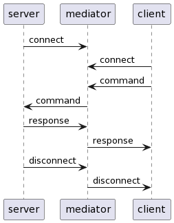

# cicd-shell

Shell for fiddling with ci/cd: executing commands, pushing and pulling files.

# Using

Run mediator on public server (vps).

```bash
ssh user@your.public.server
git clone --depth=1 https://github.com/mugiseyebrows/cicd-shell.git
cd cicd-shell/mediator
npm i
node index.js my-server-secret my-client-secret
```

Insert `cicd-shell-server` action to pipeline:

```yaml
    - uses: mugiseyebrows/cicd-shell-server@v1
      with:
        host: your.public.server
        port: 8857
        secret: ${{ secrets.SERVER_SECRET }}
```

Or, if your ci/cd is not github actions:

```yaml
run: git clone --depth=1 https://github.com/mugiseyebrows/cicd-shell.git
run: cd cicd-shell/server && npm i
run: node cicd-shell/server/index.js your.public.server 8857 ${{ secrets.SERVER_SECRET }}
```

Commit and push.

Wait until mediator prints `server connected`.

Run `pyqtclient` on local machine. 

```bash
git clone --depth=1 https://github.com/mugiseyebrows/cicd-shell.git
python cicd-shell/pyqtclient/main.py
```

Connect to `your.public.server` and execute commands.


# How it works

- Server connects to mediator and waits for command.
- Client connects to mediator, sends command and waits for responce. 
- Mediator sends command to server, recieves responce, sends responce to client.
- Server closes connection to mediator. 
- Mediator closes connection to client.
- Server reconnects for next command.



# Protocol

There are regular commands that got executed in shell (using `child_process.spawn`) and few special commands that doesn't. Special commands starts with `:`.

Client send messages in json format, with optional binary tail (`:push` command). Like this:

```json
{"command": "echo 1"}
```

Server responds in plain text or in binary (`:pull` command) or in json (`:info` command).

## Special commands

```javascript
// description
> client request
< server response

// upload file
> {"command":":push", "path": "path/to/dir/or/file", "name": "name.ext", "file_size": size in bytes}binary data (file contents)
< file path/to/dir/or/file writen

// get file size
> {"command":":info", "path": "path/to/file"} 
< {"file_size": size in bytes}

// download file
> {"command":":pull", "path": "path/to/file"}
< binary data (file contents)

// get cwd
> {"command":":pwd"}
< current working directory
```

# Security

Connections secured by shared secrets. Mediator shares one secret with server and one secret with client. Secrets are passed to applications as positional arguments. Use `--help` for details.

Server sends json `{"secret": "shared secret"}` after connection to mediator, client sends secret inside all messages. Mediator extracts and validates secrets.