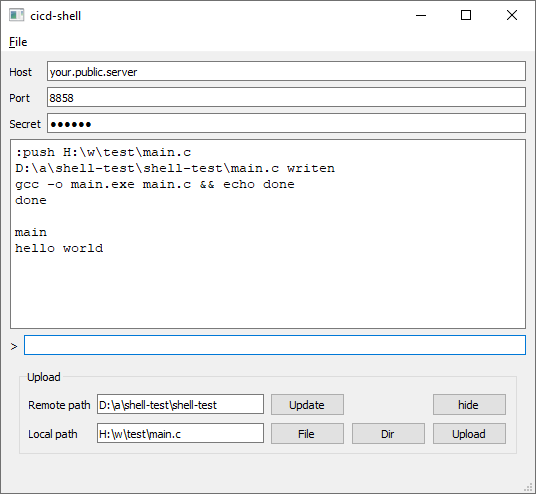

# cicd-shell

Shell for interactive fiddling with ci/cd.

You need to run mediator on public server (vps).

```bash
ssh user@your.public.server
git clone --depth=1 https://github.com/mugiseyebrows/cicd-shell.git
node cicd-shell/mediator/index.js
```

Then commit to ci/cd (github actions)

```yaml
jobs:
  main:
    runs-on: windows-latest
    steps:
    - uses: actions/setup-node@v3
    - run: git clone --depth=1 https://github.com/mugiseyebrows/cicd-shell.git
    - run: node cicd-shell\server\index.js your.public.server 8857
```

Wait until mediator prints `server connected`.

Then run pyqtclient on your machine, connect to `your.public.server:8858`, and execute commands.

```cmd
git clone --depth=1 https://github.com/mugiseyebrows/cicd-shell.git
python cicd-shell\pyqtclient\main.py
```



# How it works

- Server connects to mediator and waits for command.
- Client connects to mediator, sends command and waits for responce. 
- Mediator sends command to server, recieves responce, sends responce to client.
- Server closes connection to mediator. 
- Mediator closes connection to client.
- Server reconnects for next command.